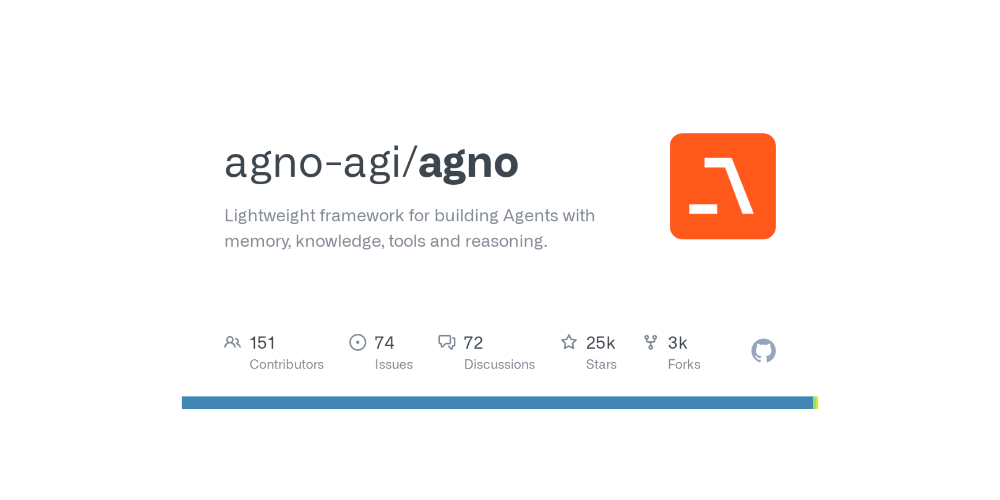

# Agents

## What is an Agent?

Agents are intelligent programs that solve problems autonomously.

Agents have memory, domain knowledge and the ability to use tools (like searching the web, querying a database, making API calls). Unlike traditional programs that follow a predefined execution path, Agents dynamically adapt their approach based on the context and tool results.

Instead of a rigid binary definition, let’s think of Agents in terms of agency and autonomy.

    Level 0: Agents with no tools (basic inference tasks).
    Level 1: Agents with tools for autonomous task execution.
    Level 2: Agents with knowledge, combining memory and reasoning.
    Level 3: Teams of specialized agents collaborating on complex workflows.


## Agno Framework



Agno is a lightweight library for building Agents with memory, knowledge, tools and reasoning.

Developers use Agno to build Reasoning Agents, Multimodal Agents, Teams of Agents and Agentic Workflows.


```python
from agno.agent import Agent
from agno.models.anthropic import Claude
from agno.tools.reasoning import ReasoningTools
from agno.tools.yfinance import YFinanceTools

agent = Agent(
    model=Claude(id="claude-3-7-sonnet-latest"),
    tools=[
        ReasoningTools(add_instructions=True),
        YFinanceTools(stock_price=True, analyst_recommendations=True, company_info=True, company_news=True),
    ],
    instructions=[
        "Use tables to display data",
        "Only output the report, no other text",
    ],
    markdown=True,
)
agent.print_response("Write a report on NVDA", stream=True, show_full_reasoning=True, stream_intermediate_steps=True)
```


### Official Docs

[Agno Docs](https://docs.agno.com/introduction)

