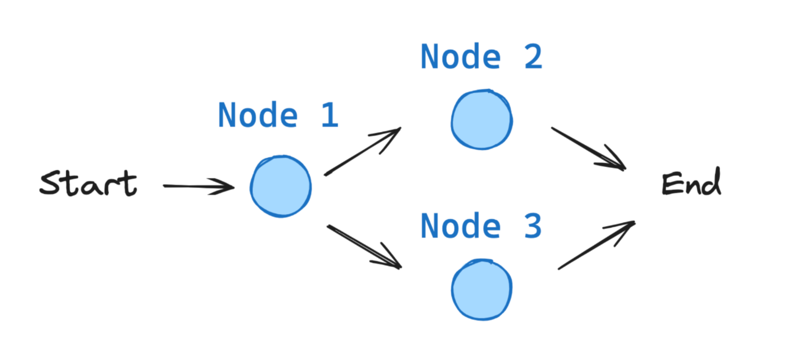

# LangGraph

LangGraph is a library for building stateful, multi-actor applications with LLMs, used to create agent and multi-agent workflows.

## Basic Workflow

Learn the basics of LangGraph

[Code](01_graph.md)

