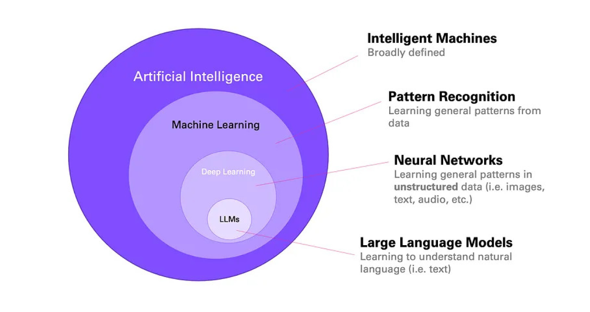
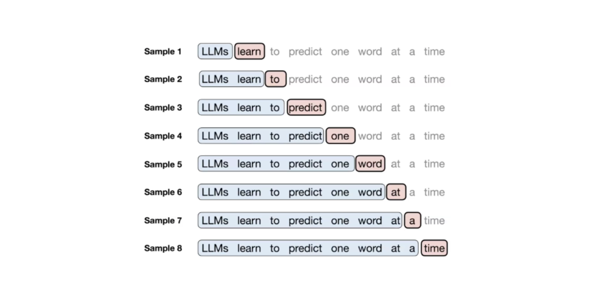

# Large Language Models

## What is a LLM ?

A Large Language Model (LLM) is a type of artificial neural network that has been trained on massive amounts of text data to understand and generate human-like language. These models contain billions or even trillions of parameters that help them recognize patterns, context, and relationships in language.

LLMs are built on the **Transformer architecture**, which uses attention mechanisms to process and understand text. They learn by analyzing vast datasets containing books, articles, websites, and other text sources to develop a deep understanding of language structure, grammar, facts, and even reasoning patterns.

It's the type of model behind the most popular chatbots like ChatGPT, Claude, Gemini, and many others.

## How Do LLMs Actually Work?

Think of an LLM like a very sophisticated **autocomplete system** - similar to what you see on your phone's keyboard, but incredibly more advanced.

### The Big Picture

Imagine you're reading a book and trying to guess the next word. You'd look at:
- The words that came before
- The overall context and meaning
- Patterns you've learned from reading millions of other books

That's essentially what an LLM does, but with mathematical precision and at lightning speed.

## Do LLM's Really Think Like Humans?

Not exactly, but the comparison is fascinating.

### What LLMs Do
- **Pattern Recognition**: Identify complex patterns in text data
- **Statistical Prediction**: Generate the most likely next word based on training
- **Contextual Understanding**: Use surrounding text to disambiguate meaning
- **Information Synthesis**: Combine knowledge from different sources

### How This Differs from Human Thinking
- **No Consciousness**: LLMs don't have subjective experiences or awareness
- **No True Understanding**: They manipulate symbols without genuine comprehension
- **No Persistent Memory**: Each conversation starts fresh (unless explicitly given context)
- **No Learning During Inference**: They don't learn from individual conversations

### The Illusion of Understanding
LLMs are incredibly sophisticated at:
- Maintaining coherent conversations
- Following complex instructions
- Demonstrating apparent reasoning
- Showing creativity and insight

This creates a compelling illusion of human-like intelligence, even though the underlying mechanisms are fundamentally different.

## Capabilities and Limitations

### What LLMs Excel At
- **Text Generation**: Writing articles, stories, code, emails
- **Translation**: Converting between languages
- **Summarization**: Condensing long texts into key points
- **Question Answering**: Providing information on diverse topics
- **Code Generation**: Writing and debugging programs
- **Creative Tasks**: Poetry, storytelling, brainstorming

### Current Limitations
- **Hallucination**: Generating false but plausible-sounding information
- **Knowledge Cutoff**: Training data has a specific end date
- **Lack of Real-time Information**: No access to current events or live data
- **Mathematical Reasoning**: Can struggle with complex calculations
- **Consistency**: May give different answers to the same question
- **Bias**: Reflects biases present in training data
