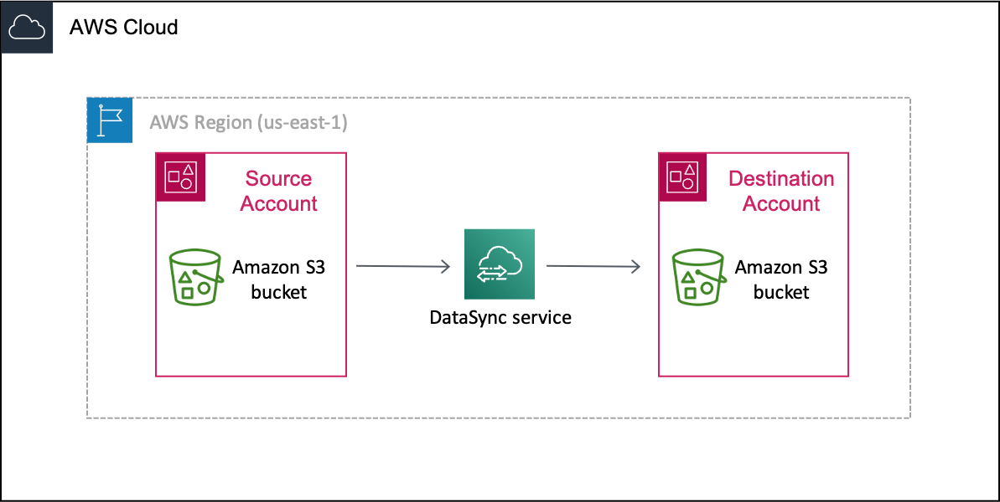

# DataSync

## Use Case



## Cross Account S3 Data Transfer

[Official Docs](https://docs.aws.amazon.com/datasync/latest/userguide/tutorial_s3-s3-cross-account-transfer)

### Extras
:::tip
if using cloud shell, assume the respective role
:::

```bash
# get current role
aws sts get-caller-identity

# assume role
aws sts assume-role --role-arn arn:aws:iam::source-user-account:role/source-datasync-role --role-session-name create-sync-session

# export variables
export AWS_ACCESS_KEY_ID=ASIAQ...
export AWS_SECRET_ACCESS_KEY=k/bNkkagOc...
export AWS_SESSION_TOKEN=...BYNOpGHA==

# create cross account location
aws datasync create-location-s3 \
  --s3-bucket-arn arn:aws:s3:::destination-bucket \
  --s3-config '{
    "BucketAccessRoleArn":"arn:aws:iam::source-user-account:role/source-datasync-role"
  }'
#
```

:::tip
if you get this error: 

DataSync bucket access test failed: could not perform s3:HeadBucket on bucket. Access denied. Ensure bucket access role has s3:ListBucket permission.

Remember to add permissions to your user in the destination folder
:::

```json
    {
        "Sid": "UserDataSyncCreateS3Location",
        "Effect": "Allow",
        "Principal": {
            "AWS": "arn:aws:iam::source-user-account:user/user-name"
        },
        "Action": "s3:ListBucket",
        "Resource": "arn:aws:s3:::destination-bucket"
    }
```


