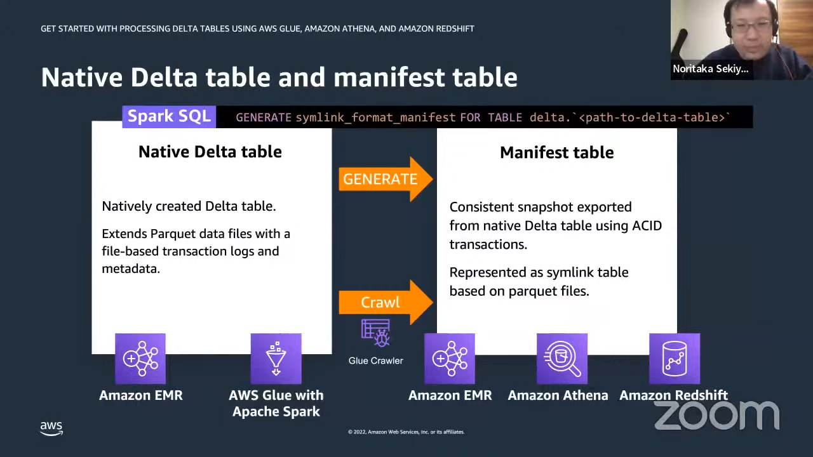

# Redshift

::: tip
[SQL Commands in Redshift](https://docs.aws.amazon.com/redshift/latest/dg/c_SQL_commands.html)
:::

## Delta to Redshift



## Create table

## Grant

[Oficial Docs](https://docs.aws.amazon.com/redshift/latest/dg/r_GRANT.html)

```sql 
grant all on schema schema_name to "user_name";
```

## Users

### List
```sql
select * from pg_user;
```

### Superuser
```sql
ALTER USER "user_name" WITH CREATEUSER
```

## Groups

Create
```sql
create group <GROUP_NAME> with user <USER_NAME1>, <USER_NAME2>;
```

Add user to group
```sql
alter group <GROUP_NAME> add user <USER_NAME>;
```

Remove users from group
```sql
alter group <GROUP_NAME> drop user <USER_NAME1>, <USER_NAME2>;
```

Delete group
```sql
drop group <GROUP_NAME>;
```

::: tip
If the group has privileges for an object, first revoke the privileges before dropping the group. The following example revokes all privileges on all tables in the public schema from the GUEST user group, and then drops the group.
:::

```sql
revoke all on all tables in schema public from group guest;
drop group guests;
```

## Parquet to Redshift

```python
    def spark_to_redshift_type(self, spark_type:str, precision:Union[str,None]):
        """
        - Convert spark type to redshift type
        """

        mapping = {
            "integer": "INTEGER",
            "long": "BIGINT",
            "float": "REAL",
            "double": "DOUBLE PRECISION",
            "decimal": f"DECIMAL{precision}",
            "string ": "VARCHAR",
            "timestamp": "TIMESTAMP",
            "date": "DATE",
        }

        return mapping.get(spark_type, "VARCHAR")

    def generate_redshift_create_table(self, df: DataFrame, table_name: str) -> str:
        schema = df.schema
        columns = []
        for field in schema.fields:

            if isinstance(field.dataType, DecimalType):
                precision = f"({field.dataType.precision},{field.dataType.scale})"
            else:
                precision = None

            redshift_type = self.spark_to_redshift_type(field.dataType.typeName(), precision)
            columns.append(f"{field.name} {redshift_type}")
        columns_str = ", ".join(columns)
        create_table_sql = f"CREATE TABLE IF NOT EXISTS {table_name} ({columns_str});"

        logging.warning(f"create_table_sql: {create_table_sql}")
        return create_table_sql

    def execute_redshift_query(self, query: str, redshift_credentials: dict):
        conn = psycopg2.connect(
            dbname=redshift_credentials["dbname"],
            user=redshift_credentials["user"],
            password=redshift_credentials["password"],
            host=redshift_credentials["host"],
            port=redshift_credentials["port"],
        )
        with conn.cursor() as cursor:
            cursor.execute(query)
        conn.commit()
        conn.close()
```
And just use it like:

```python
schema_table = schema + "." + table_name
create_table_sql = self.generate_redshift_create_table(df, schema_table)
self.execute_redshift_query(create_table_sql, self.redshift_credentials)
```

### Errors on copy

If you get errors like this:

```sql
error:  Spectrum Scan Error
  code:      15007
  context:   File 'https://... parquet ... c000.snappy.parquet' has an incompatible Parquet schema for column 's3://
  query:     43966693
  location:  dory_util.cpp:1509
  process:   worker_thread [pid=13526]
```

You can query the details on:

```sql
select message
  from SVL_S3LOG
 where query = 43966714
 order by query,segment,slice;
```
