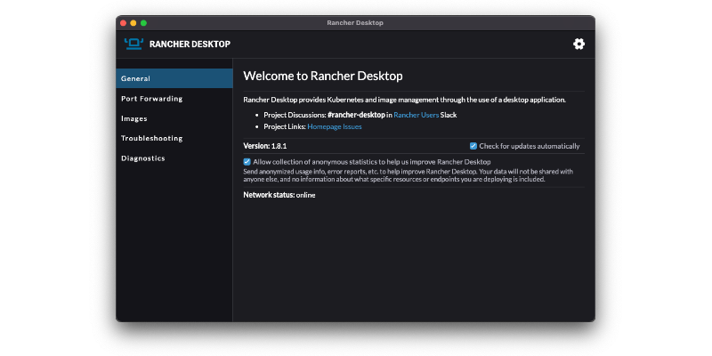
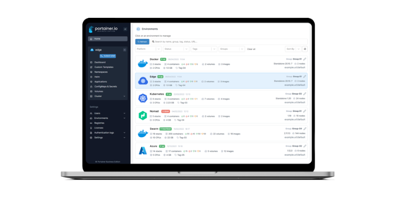
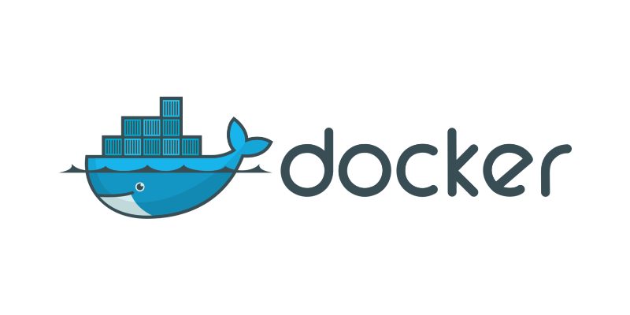

# Containers

## Rancher Desktop

A great alternative to docker desktop.
Rancher Desktop is delivered as a desktop application.
You can download it from the releases page on GitHub.

https://docs.rancherdesktop.io/getting-started/installation/



## Portainer

Portainer Community Edition (CE) is our foundation. With over half a million regular users, CE is a powerful, open source toolset that allows you to easily build and manage containers in Docker, Docker Swarm, Kubernetes and Azure ACI.

https://docs.portainer.io/start/install-ce



::: warning
Attention to install the correct version CE (Community Edition).
:::

Create volume
```bash
docker volume create portainer_data
```

Run portainer
```bash
docker run -d -p 8000:8000 -p 9000:9000 --name=portainer --restart=always -v /var/run/docker.sock:/var/run/docker.sock -v portainer_data:/data portainer/portainer-ce
```

## Lazydocker

Lazydocker is a simple terminal UI for both docker and docker-compose, written in Go.


```bash
brew install jesseduffield/lazydocker/lazydocker
```

## Container Management

Basic commands to manage containers




```bash
# List all local images
docker images

# Run image
docker run image

# Destroy image
docker rmi image

# Start container
docker start container

# Stop container
docker stop container

# Destroy container
docker rm container

# List running containers
docker ps

# List all containers
docker ps -a
```

## Build Images

```bash
# Login into dockerhub
docker login --username=theuzz1

# If building from arm machimes, remember to use correct platform to build
docker buildx build --platform=linux/amd64 -t kafka-admin:latest  .

# Tag the image
docker image tag kafka-admin theuzz1/kafka-admin:latest

# Push to dockerHub
docker image push theuzz1/kafka-admin:latest
```

## Dockerfile

Example of a Dockerfile declaration

```bash
# Base image
FROM debian:latest

# Define mantainer
LABEL maintainer="Matheus S. Rossi"

# Update and upgrade debian
RUN apt-get update && apt-get upgrade -y

# Ngix install
RUN apt-get install nginx -y

# Exposing port 80
EXPOSE 80

# Starting NGINX container
CMD ["nginx", "-g", "daemon off;"]

```

## Multi Stage Build

Important to keep images clean and light weight.

```bash
# -------------------
# BEGIN STAGE BUILD
# -------------------

FROM debian:11 as stage

WORKDIR /jars

RUN apt-get update \
    && apt install -y curl 

# Jars to download into stage build
RUN curl -LJO https://repo1.maven.org/maven2/org/apache/hadoop/hadoop-aws/3.3.4/hadoop-aws-3.3.4.jar
RUN curl -LJO https://repo1.maven.org/maven2/com/amazonaws/aws-java-sdk-bundle/1.12.433/aws-java-sdk-bundle-1.12.433.jar

# -------------------
# END STAGE BUILD
# -------------------

FROM apache/spark:v3.3.2

# Jars to copy from stage into spark base image
COPY --from=stage /jars /opt/spark/jars

USER 0

RUN apt-get update \
    && apt install -y python3 python3-pip \
    && pip3 install --upgrade pip setuptools \
    && rm -r /root/.cache \
    && rm -rf /var/cache/apt/* 

RUN pip3 install pyspark==3.3.2 \
    && pip3 install 

WORKDIR /opt/spark/work-dir

ENTRYPOINT ["/opt/entrypoint.sh"]

ARG spark_uid=185

USER 185
```