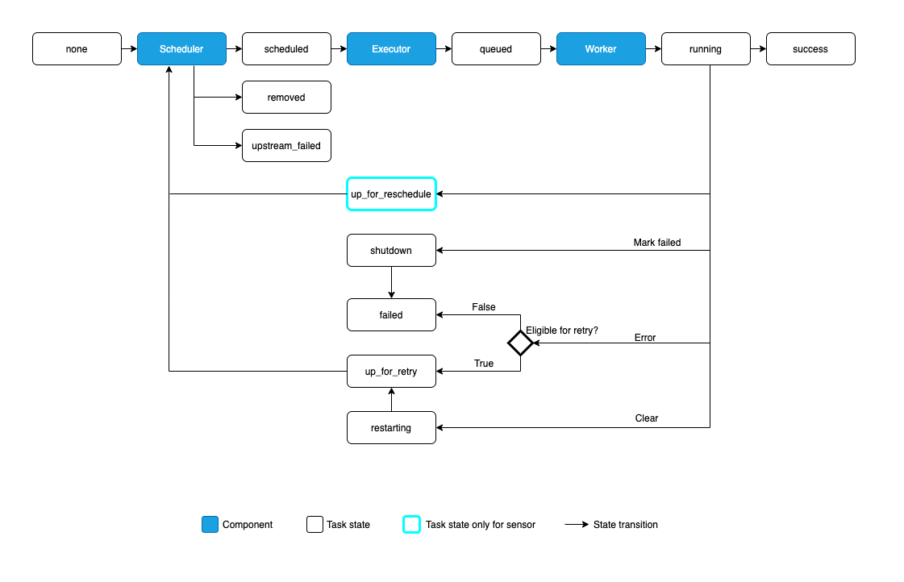

# Apache Airflow Concepts

## Basic Architecture

{data-zoomable}

## Life Cycle

{data-zoomable}

## Parameters

## Xcom

## Callbacks

* on_failure_callback
* on_retry_callback
* on_success_callback
* sla_miss_callback

## How to handle failures

* retry
* retry_delay
* email_on_retry
* email_on_failure
* on_failure_callback
* on_retry_callback

## SLA

Service Level Agreement, is an expectation for the maximum time a Task should be completed relative to the Dag Run start time. If a task takes longer than this to run, it is then visible in the “SLA Misses” part of the user interface, as well as going out in an email of all tasks that missed their SLA.

Tasks over their SLA are not cancelled, though - they are allowed to run to completion. If you want to cancel a task after a certain runtime is reached, you want Timeouts instead.

```python
delay_python_task = PythonOperator(
  task_id="task_id",
  sla=timedelta(minutes=2),
  python_callable=lambda: time.sleep(300),
)
```

## Connections Examples

### K8s Cluster

```json
  "kubernetes_default": {
    "conn_type": "kubernetes",
    "description": "",
    "login": "admin",
    "password": "admin",
    "host": "",
    "port": null,
    "schema": "",
    "extra": "{\"in_cluster\": true, \"disable_verify_ssl\": false, \"disable_tcp_keepalive\": false}"
  }
```

### Postgres

```json
  "postgresql": {
    "conn_type": "postgres",
    "description": "",
    "login": "postgres",
    "password": "postgres",
    "host": "postgresql.postgresql.svc",
    "port": 5432,
    "schema": "",
    "extra": ""
  }
```

### Datahub GMS

```json
  "datahub_rest_default": {
    "conn_type": "datahub_rest",
    "description": "",
    "login": "admin",
    "password": null,
    "host": "http://datahub-datahub-gms.datahub.svc:8080",
    "port": null,
    "schema": "",
    "extra": ""
  }
```

### MinIO

```json

  "minio": {
    "conn_type": "aws",
    "description": "",
    "login": "minio-access-key-id",
    "password": "minio-secret-access-key",
    "host": "",
    "port": null,
    "schema": "",
    "extra": "{\"endpoint_url\": \"http://minio.minio.svc:9000\", \"region_name\": \"local\"}"
  }
```

## Import files from project

How to import files to a dag.

```python
DIR_PATH = pathlib.Path(__file__).parent.absolute()

# EMR
EMR_CONFIG=f'{DIR_PATH}/conf/emr.json'
```
