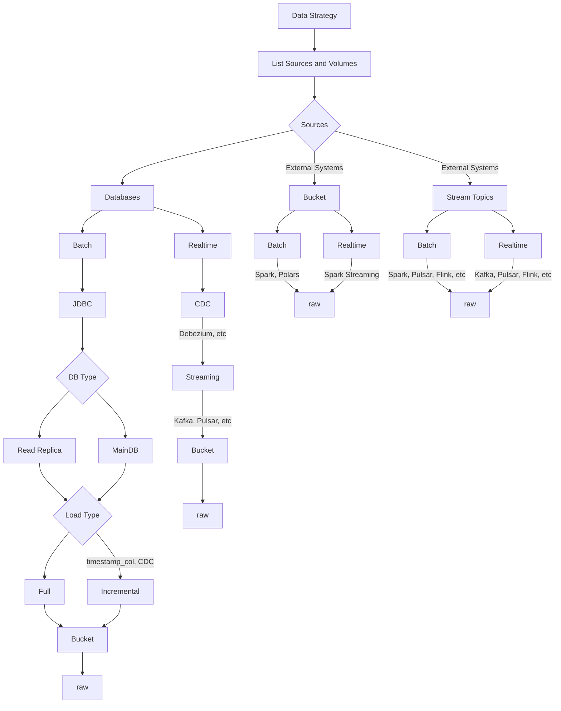

# Data Engineering Concepts

## Concepts

Comparing Data Warehouse vs Data Lake vs Data Lakehouse

| Characteristic | Data Warehouse (DW) | Data Lake (DL) | Data Lakehouse (DLW) |
|---|---|---|---|
| **Data Structure** | Structured (Schema-on-Write) | Unstructured/Semi-structured (Schema-on-Read) | Both Structured & Unstructured |
| **Query Performance** | Fast (pre-aggregated, indexed) | Variable (depends on format/size) | Fast (metadata & caching optimized) |
| **Schema Evolution** | Rigid, expensive to change | Flexible, easy to adapt | Flexible with versioning support |
| **Data Quality** | High (enforced at ingestion) | Variable (depends on governance) | High (ACID transactions, validation) |
| **Use Cases** | BI, Reporting, Analytics | Data Science, ML, Exploration | BI, Analytics, ML, Real-time |
| **Scalability** | Vertical (limited) | Horizontal (unlimited) | Horizontal (unlimited) |
| **Governance** | Strong (built-in) | Weak (manual implementation) | Strong (built-in ACID, lineage) |
| **Examples** | Snowflake, Redshift, BigQuery | S3, HDFS, Azure Data Lake | Databricks, Delta Lake, Apache Iceberg |

## Ingestion Flow

