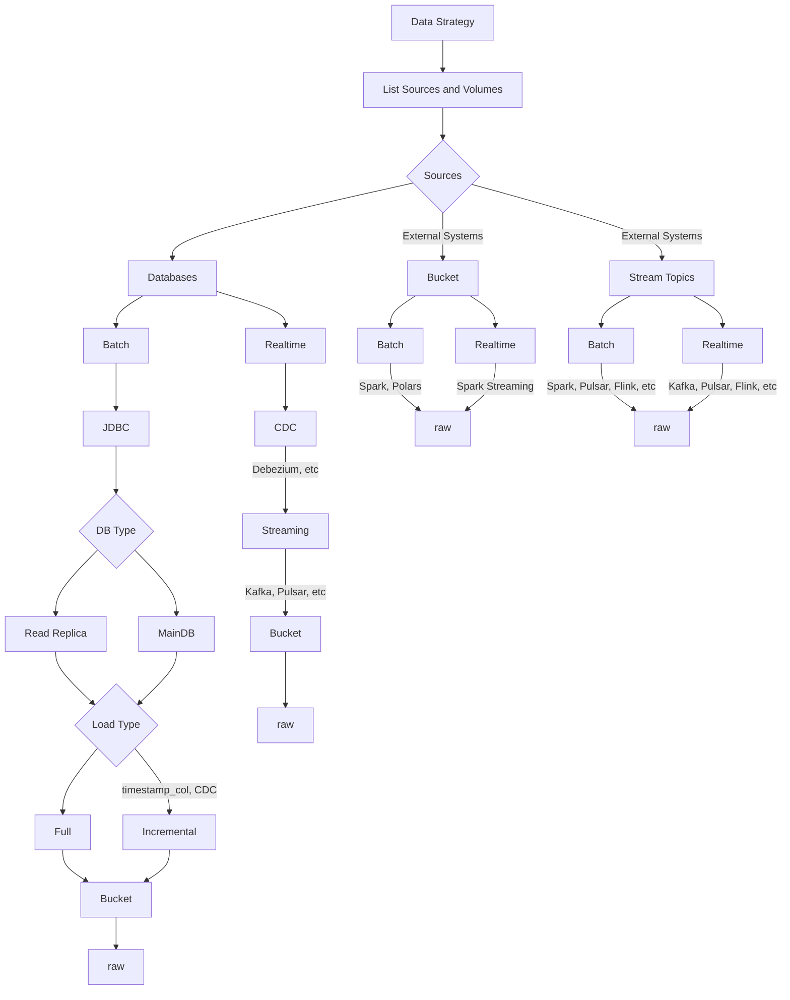

# Data Engineering Concepts

## DataWarehouse

## DataLake

## DataLakeHouse

## Ingestion Flow

```mermaid
flowchart TD
    A[Data Strategy] --> B[List Sources and Volumes]
    B --> C{Sources}
    C --> D[Databases]
    D --> E[Batch]
    E --> JC[JDBC]
    JC --> TB{DB Type}
    TB --> MB[MainDB]
    TB --> RR[Read Replica]
    RR --> LR{Load Type}
    MB --> LR
    LR --> FL[Full]
    LR --> |timestamp_col, CDC| IC[Incremental]
    FL --> BD[Bucket]
    IC --> BD
    BD --> ZNBR[raw]
    D --> F[Realtime]
    F --> CC[CDC]
    CC --> |Debezium, etc| ST[Streaming]
    ST --> |Kafka, Pulsar, etc| BS[Bucket]
    BS --> ZNDR[raw]
    C --> |External Systems| G[Bucket]
    G --> H[Batch]
    G --> I[Realtime]
    H --> |Spark, Polars| ZNB[raw]
    I --> |Spark Streaming | ZNB[raw]
    C --> |External Systems| J[Stream Topics]
    J --> K[Batch]
    J --> L[Realtime]
    K --> |Spark, Pulsar, Flink, etc| ZNS[raw]
    L --> |Kafka, Pulsar, Flink, etc| ZNS
```