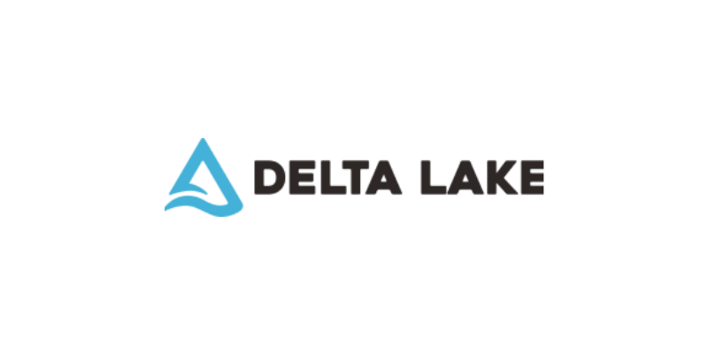
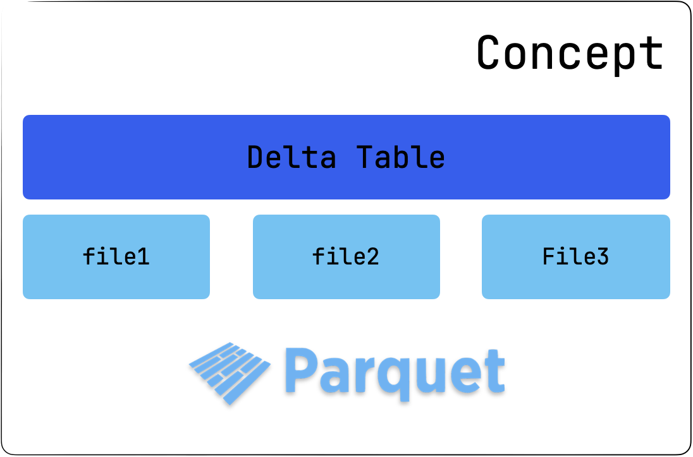
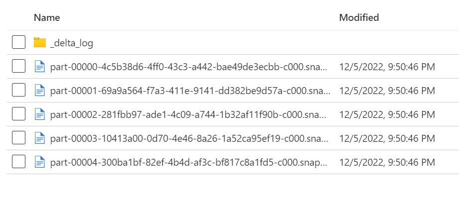
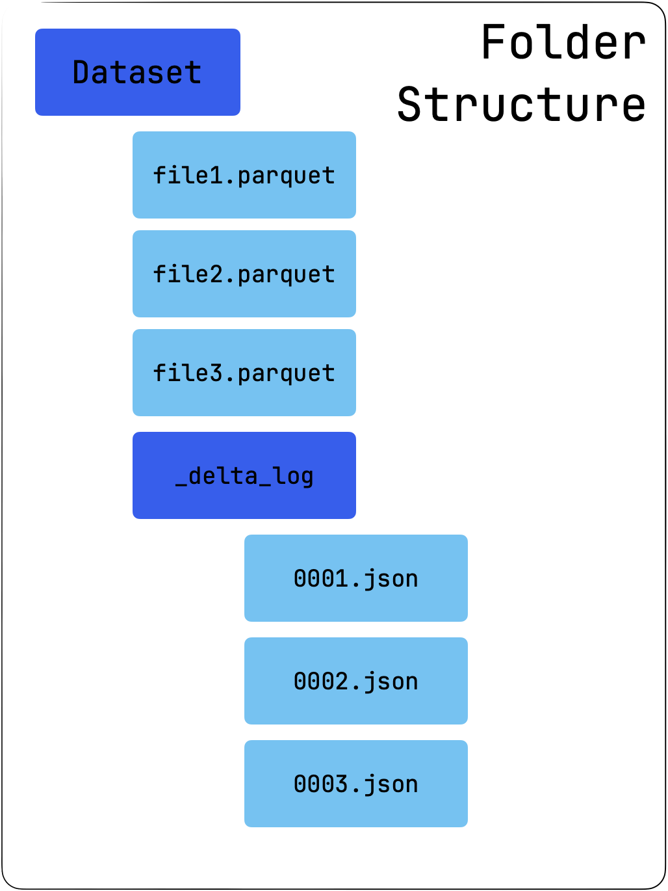

# Delta Lake



[Official Docs](https://docs.delta.io/latest/index.html)

## Delta and Databricks

Delta Lake is an open-source storage framework that enables building a Lakehouse architecture with compute engines including Spark, PrestoDB, Flink, Trino, and Hive and APIs for Scala, Java, Rust, Ruby, and Python.

Databricks originally developed the Delta Lake protocol and continues to actively contribute to the open source project. Many of the optimizations and products in the Databricks Lakehouse Platform build upon the guarantees provided by Apache Spark and Delta Lake.

Main features:
 - ACID transactions

| Atomicity | Consistency | Isolation | Durability |
|-----------|-------------|-----------|------------|
| All or nothing | Data is always valid | Concurrent reads and writes | Data is always available |
| Commit or rollback | Types, PK | Read committed / uncommitted | Persisted to disk |

 - Schema enforcement
 - Schema evolution
 - Time travel
 - Audit history
 - Upserts / Merge
 - Deletes
 - Streaming
 - Change Data Feed

## Apache Parquet

Apache Parquet is an open source, column-oriented data file format designed for efficient data storage and retrieval.

[Parquet File Format](https://parquet.apache.org/)

## Delta Concept
::: tip
- Delta is NOT a file format
- Delta uses PARQUET as file format.
:::

{data-zoomable}

Real example:

{data-zoomable}

## Delta Folder Structure

{data-zoomable}

_delta_log is a folder that contains the transaction log of all the changes made to the table.

- 00001.json is the first version of the table.
- 00002.json is the second version of the table.
- and so on...

## How to use Delta

In order to use all Delta features, you probably want to use Spark, but you can also use Delta without it.

::: tip
It's possible to use Delta without Spark, but not all features are available.

See [Delta-Rs](https://github.com/delta-io/delta-rs) for example.
:::

### Local Spark

You can use the [Spark Quickstart](/development/data-engineering/spark/index.md) to get a local Spark cluster running.

### Delta Versions

::: warning
You must match the Delta version with the Spark version.

See [Delta Versions](https://docs.delta.io/latest/releases.html#compatibility-with-apache-spark) for more information.
:::

### Usage with PySpark

You can import Delta Lake using the following code:

```python
from pyspark.sql import SparkSession
from delta import *

spark = ( 
    SparkSession
    .builder
    .master("local[*]")
    .config("spark.jars.packages", "io.delta:delta-core_2.12:2.1.0")
    .config("spark.sql.extensions", "io.delta.sql.DeltaSparkSessionExtension")
    .config("spark.sql.catalog.spark_catalog", "org.apache.spark.sql.delta.catalog.DeltaCatalog")
    .getOrCreate() 
)
```

## Basic Operations

### Check if delta exists

```python
DeltaTable.isDeltaTable(spark, "path/table") 
#True or False
```

### Create

```python
(
    df
    .write
    .format("delta")
    .mode("append")
    .partitionBy("column")
    .save("path/table")
)
```

#### Create if not exists
::: tip
if merging data, you must create the table first, otherwise you will get an error.
:::

```python
(
    DeltaTable
        .createIfNotExists(spark)
        .tableName(table_name)
        .addColumns(df.schema)
        .location(path)
        .execute()
)
```

### Merge / Upsert
::: tip
Working in progress
:::

### Delete
::: tip
Working in progress
:::

## Change Data Feed
::: tip WIP
Work in progress
:::

CDC, but for Delta Tables.

```sql
CREATE TABLE student
    (id INT, name STRING, age INT)
    TBLPROPERTIES (delta.enableChangeDataFeed = true)
-- or
ALTER TABLE myDeltaTable
    SET TBLPROPERTIES (delta.enableChangeDataFeed = true)
```

```python
# version as ints or longs
(
    spark
    .read
    .format("delta")
    .option("readChangeFeed", "true")
    .option("startingVersion", 0)
    .option("endingVersion", 10)
    .load("pathToMyDeltaTable")

)

# timestamps as formatted timestamp
(
    spark
    .read
    .format("delta")
    .option("readChangeFeed", "true")
    .option("startingTimestamp", '2021-04-21 05:45:46')
    .option("endingTimestamp", '2021-05-21 12:00:00')
    .load("pathToMyDeltaTable")
)

# providing only the startingVersion/timestamp
(
    spark
    .read
    .format("delta")
    .option("readChangeFeed", "true")
    .option("startingVersion", 0)
    .load("pathToMyDeltaTable")
)
```

## Optimize

Small files are a common problem in data lakes. They can cause performance issues and increase costs.

```python
from delta.tables import *

deltaTable = DeltaTable.forPath(spark, pathToTable)

deltaTable.optimize().executeCompaction()
```
If you have a large amount of data and only want to optimize a subset of it, you can specify an optional partition predicate using `where`

```python
deltaTable.optimize().where("date='2021-11-18'").executeCompaction()
```