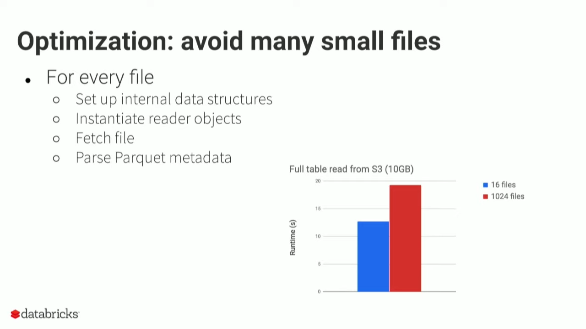
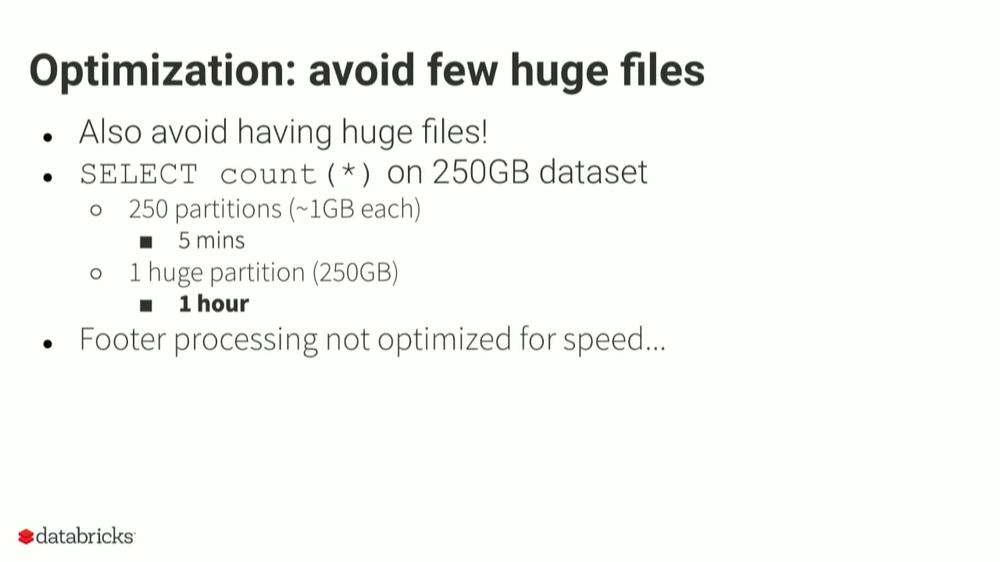

# File Formats
::: tip
Working in progress
:::

Working with data also means working with files. There are many file formats available, each with its own advantages and disadvantages.

## txt

## csv

## xlsx / xls

## json

## parquet
::: tip
[Parquet Explained by Databricks](https://youtu.be/1j8SdS7s_NY)
:::

Small Files

Big Files

## orc

## avro

## protobuf