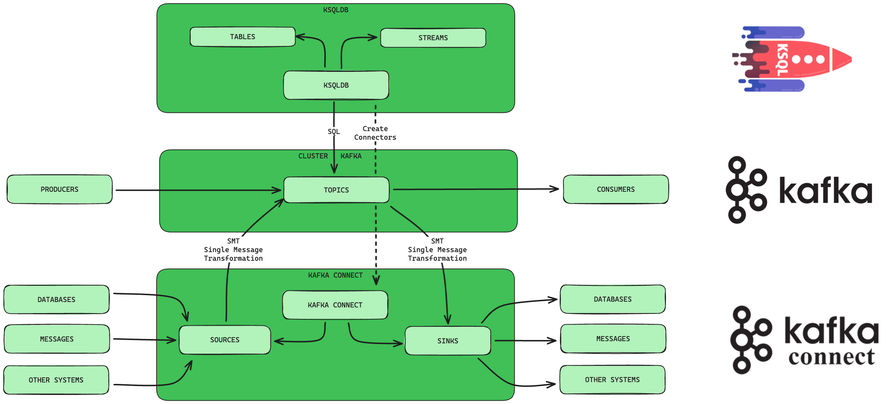

# Kafka

## Concepts

:::tip
Kafka EcoSystem
:::

{data-zoomable}

## Kafka Cluster

### Strimzi 


[[Official Docs](https://strimzi.io/)]

## Kafka Connect

### Sources

### Sinks

### Camel Tools

[Official Docs](https://camel.apache.org/camel-kafka-connector/4.0.x/)

## Ksql

:::tip Useful Docs
[Official Docs](https://docs.ksqldb.io/en/latest/) <br>
[Topic Tale](https://topictale.com/ksqldb/how-to-get-started/)
:::

## Ksql CLI
```shell
$ ./bin/ksql --help
```

```shell
--execute <execute>, -e <execute>
# Execute one or more SQL statements and quit.

--file <scriptFile>, -f <scriptFile>
# Execute commands from a file and exit.
```

### Queries (Pull vs Push)

### Streams
:::tip
[Official Docs](https://docs.ksqldb.io/en/latest/developer-guide/ksqldb-reference/create-stream/)
:::

Sometimes, you need to get data from the header of the topic,
to help with that, ksql provides an interesting feature:

```sql
CREATE STREAM IF NOT EXISTS FLIGHTS_STREAM (
  flight_id    STRING,
  from_airport STRING,
  to_airport   STRING,
  coordinates  STRUCT <
    lat STRING,
    lon STRING
  >
  produced_at  BYTES HEADER('producedAt')
) WITH (
  KAFKA_TOPIC  = 'source_topic',
  VALUE_FORMAT = 'JSON'
);
```

With that you get the header as bytes, that can be decoded in another stream.

```sql
CREATE OR REPLACE 
  FLIGHTS_STREAM_DECODED 
WITH ( VALUE_FORMAT = 'JSON' )
AS
  SELECT
    flight_id,
    from_airport,
    to_airport,
    coordinates->lat as coordinates_lat,
    coordinates->lon as coordinates_lon,
    FROM_BYTES(produced_at, 'utf-8') as produced_at
  FROM 
    FLIGHTS_STREAM
  PARTITION BY flight_id;
```

### Tables
:::tip
[Official Docs](https://docs.ksqldb.io/en/latest/developer-guide/ksqldb-reference/create-table/)
:::

```sql
-- TABLE <> SOURCE TABLE
CREATE SOURCE TABLE
  TABLE_FLIGHTS (
    flight_id STRING PRIMARY KEY,
    from_airport STRING,
    to_airport STRING,
    coordinates_lat STRING,
    coordinates_lon STRING,
    produced_at STRING
  ) WITH (
    KAFKA_TOPIC = 'FLIGHTS_STREAM_DECODED',
    VALUE_FORMAT = 'JSON'
  )
```
### Joins