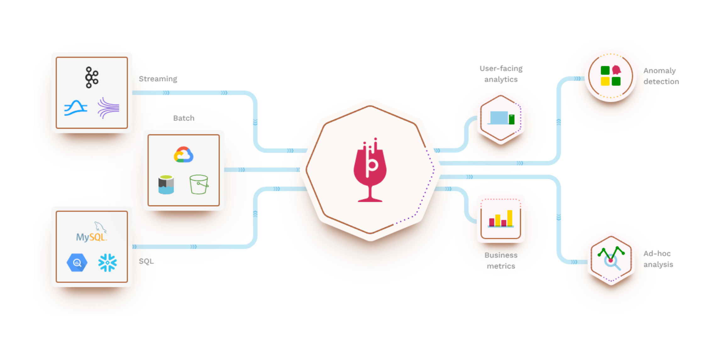
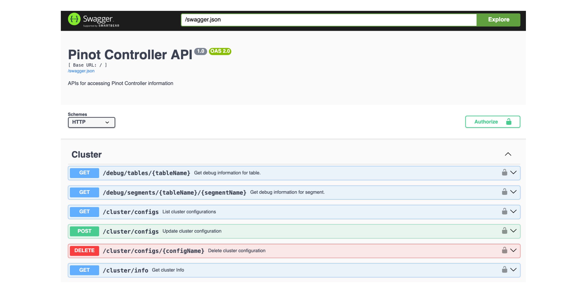
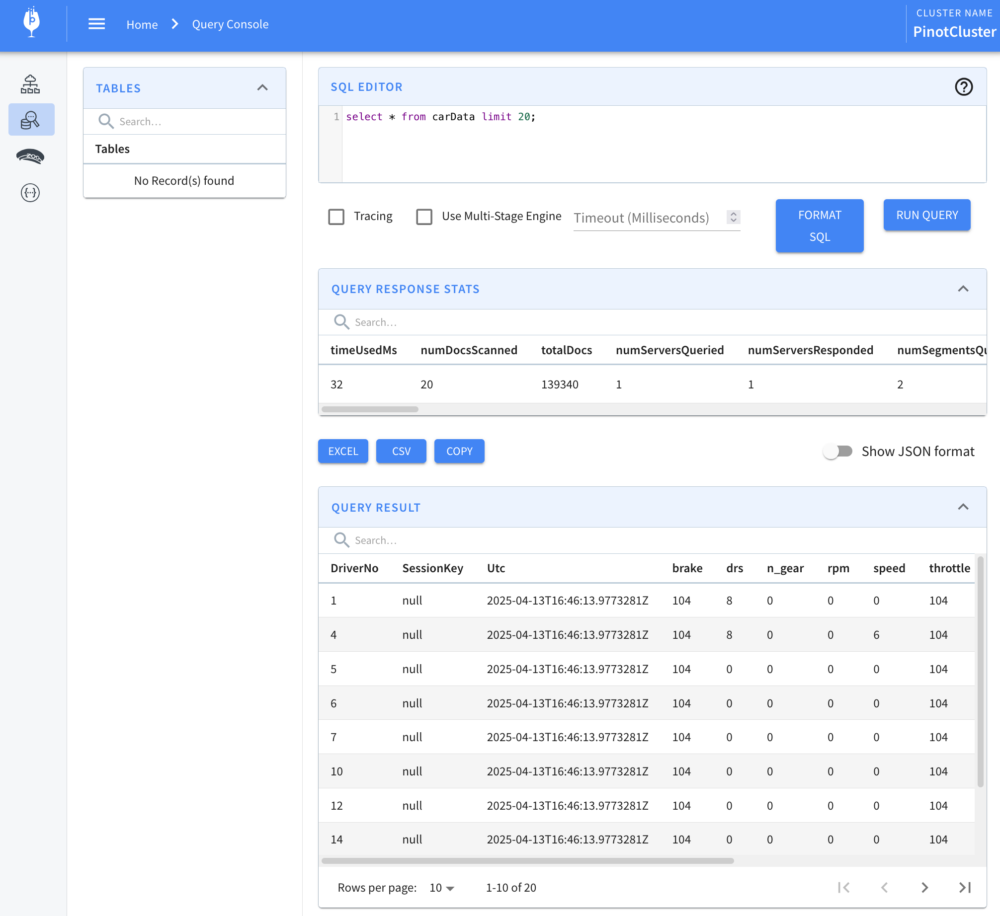

# Apache Pinot



## Introduction

Apache Pinot is a real-time distributed OLAP datastore purpose-built for low-latency, high-throughput analytics, and perfect for user-facing analytical workloads.

Apache Pinot™ is a real-time distributed online analytical processing (OLAP) datastore. Use Pinot to ingest and immediately query data from streaming or batch data sources (including, Apache Kafka, Amazon Kinesis, Hadoop HDFS, Amazon S3, Azure ADLS, and Google Cloud Storage).

### Oficial Docs

- [Apache Pinot](https://docs.pinot.apache.org/)

## Pinot API

To interact with Pinot, we can use the Pinot Rest API.

http://localhost:9000/help

{data-zoomable}


## Pinot UI

http://localhost:9000/#/

{data-zoomable}

## Examples

Get the data from a kafka topic, then upsert it to Pinot.

### Kafka-Upsert

Upsert is a feature that allows updating existing records based on a primary key. When a new record with the same primary key arrives, Pinot will either:

- Update the existing record if it already exists
- Insert a new record if no matching primary key is found

This is particularly useful for streaming use cases where you need to maintain the latest state of each entity.


#### 1 - Create data schema

```json
{
  "schemaName": "carData",
  "dimensionFieldSpecs": [
    { "name": "DriverNo", "dataType": "STRING" },
    { "name": "SessionKey", "dataType": "STRING" },
    { "name": "drs", "dataType": "INT" },
    { "name": "n_gear", "dataType": "INT" },
    { "name": "Utc", "dataType": "STRING" },
    { "name": "timestamp", "dataType": "STRING" }
  ],
  "metricFieldSpecs": [
    { "name": "rpm", "dataType": "INT" },
    { "name": "speed", "dataType": "INT" },
    { "name": "throttle", "dataType": "INT" },
    { "name": "brake", "dataType": "INT" }
  ],
  "dateTimeFieldSpecs": [
    {
      "name": "tsMillis",
      "dataType": "LONG",
      "format": "1:MILLISECONDS:EPOCH",
      "granularity": "1:MILLISECONDS"
    }
  ],
  "primaryKeyColumns": ["DriverNo"]
}
```

Then apply the schema to Pinot.

```bash
curl -s -X POST "http://localhost:9000/schemas" -H "Content-Type: application/json" -d @carData_schema.json
```

#### 2 - Create table

```json
{
  "tableName": "carData",
  "tableType": "REALTIME",
  "segmentsConfig": {
    "schemaName": "carData",
    "timeColumnName": "tsMillis",
    "timeType": "MILLISECONDS",
    "replication": "1"
  },
  "tableIndexConfig": {
    "loadMode": "MMAP",
    "streamConfigs": {
      "streamType": "kafka",
      "stream.kafka.consumer.type": "lowLevel",
      "stream.kafka.topic.name": "f1-cardata",
      "stream.kafka.decoder.class.name": "org.apache.pinot.plugin.stream.kafka.KafkaJSONMessageDecoder",
      "stream.kafka.consumer.factory.class.name": "org.apache.pinot.plugin.stream.kafka20.KafkaConsumerFactory",
      "stream.kafka.broker.list": "kafka-broker:9092",
      "stream.kafka.consumer.prop.auto.offset.reset": "smallest",
      "realtime.segment.flush.threshold.rows": "0",
      "realtime.segment.flush.threshold.time": "24h",
      "realtime.segment.flush.threshold.segment.size": "50M"
    }
  },
  "ingestionConfig": {
    "transformConfigs": [
      {
        "columnName": "tsMillis",
        "transformFunction": "fromDateTime(Utc, 'yyyy-MM-dd''T''HH:mm:ss.SSSSSSS''Z''')"
      }
    ]
  },
  "upsertConfig": {
    "mode": "FULL"
  },
  "routing": {
    "instanceSelectorType": "strictReplicaGroup"
  },
  "tenants": {},
  "metadata": {}
}
```

Then apply the table to Pinot.

```bash
curl -s -X POST -H "Content-Type: application/json" -d @pinot.config http://localhost:9000/tables
```

#### 3 - Query data

Get the most recent value.
```sql
select * from carData limit 20;
```

or get all the data for a specific key.
```sql
select * 
  from carData 
 where DriverNo=44 
 limit 20 
 option(skipUpsert=True);
```


