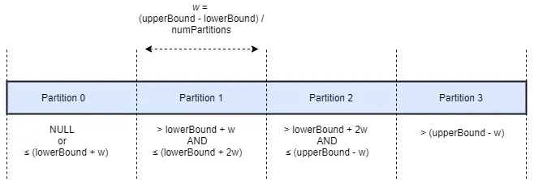

## Init 

The follwing code provides the installation of packages avro and delta. If you do not need them, you can remove them.

```python
# Import SparkSession
from pyspark.sql import SparkSession

# Create SparkSession 
spark = ( 
    SparkSession
    .builder
    .master("local[*]")
    .config("spark.jars.packages", "org.apache.spark:spark-avro_2.12:3.3.1")
    .config("spark.jars.packages", "io.delta:delta-core_2.12:2.1.0")
    .config("spark.sql.extensions", "io.delta.sql.DeltaSparkSessionExtension")
    .config("spark.sql.catalog.spark_catalog", "org.apache.spark.sql.delta.catalog.DeltaCatalog")
    .getOrCreate() 
)
```

## Read

### CSV

```python
df_csv = ( spark
	.read
    .option('delimiter', ';')
    .option('header', 'true')
    .option('inferSchema', 'true')
	.option('encoding', 'ISO-8859-1')
    .csv('data/filename.csv')
)
```

### JSON

```python
df_json = (
    spark
    .read
    .json('data/filename.json')
)
```

### Parquet

```python
df_parquet = (
    spark
    .read
    .parquet('data/parquet/')
)
```

### Delta

```python
df_delta = (
    spark
    .read
    .format('delta')
    .load('data/delta/')
)
```

### Avro

```python
# avro schema
schema = open('./data/avro/userdata.avsc', 'r').read()

df_avro = ( 
    spark
    .read
	.format('avro')
    .option('avroSchema', schema)
    .load('data/avro/*')
)
```

### ORC

```python
df_orc = (
    spark
    .read
    .orc('./data/orc/')
)
```

### JDBC

#### Simple JDBC:

```python
table = (
    spark
    .read
    .format("jdbc")
    .option("url", "<jdbc-url>")
    .option("dbtable", "<table-name>")
    .option("user", "<username>")
    .option("password", "<password>")
    .load()
)
```

#### Complex JDBC:

By default, Spark will store the data read from the JDBC connection in a single partition. As a consequence, only one executor in the cluster is used for the reading process. To increase the number of nodes reading in parallel, the data needs to be partitioned by passing all of the following four options:

- `partitioningColumn` determines which table column will be used to split the data into partitions. The data type of partitioning column needs to be `NUMERIC`, `DATE`or `TIMESTAMP`.
- `numPartitions` sets the desired number of partitions.
- `lowerBound` and `upperBound` are used to calculate the partition boundaries.

Under the hood, Spark will generate a SQL query for each partition with an individual filter on the partitioning column. The diagram below illustrates how data is divided into four partitions using the options above:



##### Partitioning example:

Change COLUMN_NAME and TABLE_NAME to your values.

```python
query_min_max = f"""
SELECT Min(COLUMN_NAME),
       Max(COLUMN_NAME)
  FROM TABLE_NAME s
"""

# Determine min and maximum values
df_min_max = spark.read.jdbc(
    url="jdbc:postgresql://db/postgres",
    table=f"({query_min_max}) t ",
    properties=connection_properties,
).collect()

min, max = df_min_max[0][0], df_min_max[0][1]

query = """
SELECT category, value
  FROM TABLE_NAME
"""

# Partition the data
df = (
    spark
    .read
    .option("numPartitions", 30)
    .option("partitionColumn", "category")
    .option("lowerBound", min)
    .option("upperBound", max)
    .jdbc(
        url="jdbc:postgresql://db/postgres",
        table=f"({query}) t ",
        properties=connection_properties,
    )
)
```

## Useful Functions

```python
# Show schema
dataframe.printSchema()

# Show first rows
# arg1 - number of rows
# arg2 - truncate column values
# arg3 - show dataframe in vertical orientation
dataframe.show(20, truncate=False, vertical=True) 

# Number of rows
dataframe.count()

# Number of columns
len(dataframe.columns)

# Select columns
dataframe.select('column_name', 'column_name2')
```

## Join

```python
# Join two dataframes
(
    table1
    .join(
        table2, 
        ( table1['user_id'] == table2['user_id'] )
        &
        ( table1['company_id'] == table2['company_id'] ),
        'inner'
    )
    .show(5)
)
```

## SparkSQL

How to run SQL queries on spark dataframes:

```python
# Create or replace view to use SQL
dataframe.createOrReplaceTempView('dataframe')

# Spark SQL Example
spark.sql("""
    SELECT COLUMN_NAME,
           COLUMN_NAME2
      FROM dataframe
     LIMIT 5
""").show()

# Drop view after usage
spark.catalog.dropTempView('dataframe')
```

## Window Functions

```python
from pyspark.sql.window import Window
from pyspark.sql import functions as F

windowSpec = (
    Window
    .partitionBy("user_id","company_id")
    .orderBy("user_id","company_id")
)

(
    table1
    .withColumn(
        "row_number", 
        F.row_number().over(windowSpec)
    )
    .show()
)

```

## Save

### Csv
```python
(
    df_csv
    .write
    .mode('overwrite')
    .option('sep', ';')
    .option('header', 'true')
    .option('encoding', 'ISO-8859-1')
    .csv('data/csv/')
)
```

### Json
```python
(
    df_json.write
    .partitionBy('color')
    .mode('overwrite')
    .json('data/path/')
)
```

### Parquet

```python
( 
	df_parquet
	.write
    .mode('overwrite')
    .parquet('data/path/dataframe.parquet')
)
```
### Delta

```python
( 
    df_delta
    .write
    .format("delta")
    .mode('overwrite')
    .save("/data/path/")
)
```

### Avro
```python
(
    df_avro
    .write
    .mode('overwrite')
    .format('avro')
    .save('data/path/')
)
```

### Orc
```python
(
    df_orc
    .write
    .partitionBy('_col5')
    .mode('overwrite')
    .orc('data/path/')
)
```

## UDF
::: tip
Work in progress
:::

## Drop Duplicates
::: warning
Be careful when using .DropDuplicates() as it won't work on multiple partitions.

It will only drop duplicates within a partition.

[Stack Overflow Thread](https://stackoverflow.com/questions/38687212/spark-dataframe-drop-duplicates-and-keep-first/58540058#58540058)
:::

```python
from pyspark.sql import Window
from pyspark.sql.functions import rank, col, monotonically_increasing_id

window = Window.partitionBy("DESIRED_COLUMN").orderBy('tiebreak')

(
    df_s
    .withColumn('tiebreak', monotonically_increasing_id())
    .withColumn('rank', rank().over(window))
    .filter(col('rank') == 1)
    .show()
)
```