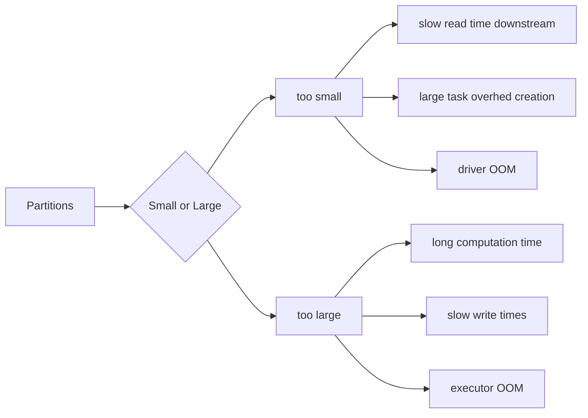

# Important Concepts

## Driver and Executors


### Driver

The driver is the process where the main method runs. First it converts the user program into tasks and after that it schedules the tasks on the executors.

### Executors

Executors are worker nodes' processes in charge of running individual tasks in a given Spark job. They are launched at the beginning of a Spark application and typically run for the entire lifetime of an application. Once they have run the task they send the results to the driver. They also provide in-memory storage for RDDs that are cached by user programs through Block Manager.

## SparkApps Sizing
::: tip
READ these series of posts by Brad Caffey.

[Brad Caffey Medium](https://medium.com/expedia-group-tech/part-3-efficient-executor-configuration-for-apache-spark-b4602929262)
:::


## Partitions


```python
# Default optimal partition size is 128MB.
partitions = dataset_size / 128MB

# Or change the default partition size
spark.conf.set("spark.sql.files.maxPartitionBytes", "128MB")
```



### Coalesce
If you want to reduce the number of partitions, you can use `coalesce()`.

ALWAYS use `coalesce()` instead of `repartition()` when you want to reduce the number's of partitions as `coalesce()` does not perform shuffle.

### Repartition

Repartition is used to increase or decrease the number of partitions in a DataFrame. It does a full shuffle of the data and creates equal sized partitions.

Prefer `coalesce()` over `repartition()` as `coalesce()` does not perform shuffle.

If you need to increase the number of partitions, use `repartition()`. Be aware that this will incur a full shuffle and it's a fairly expensive operation.

### More Details

[Coalesce vs Repartition](https://sparkbyexamples.com/spark/spark-repartition-vs-coalesce/)

## Shuffle

::: tip
Work in progress
:::

## Spark UI

::: tip
Work in progress
:::

## Caching

::: tip
Work in progress
:::

## Checkpointing
::: tip
Work in progress

[Article by Adrian Chang](https://medium.com/@adrianchang/apache-spark-checkpointing-ebd2ec065371)
:::
