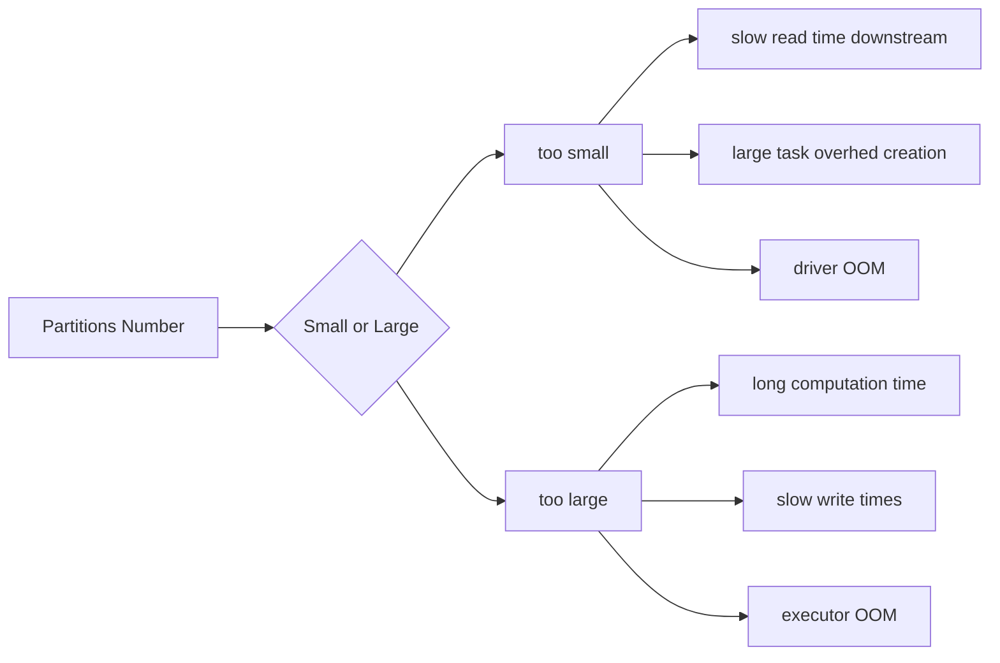
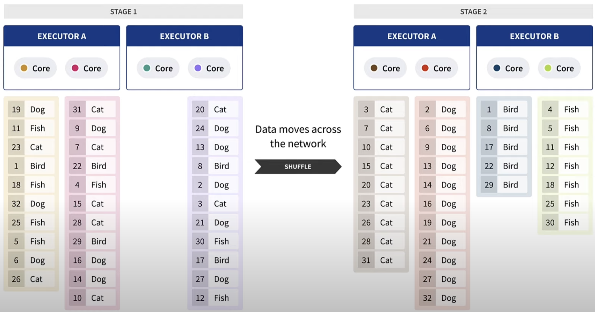

# Important Concepts

## Driver and Executors


### Driver

The driver is the process where the main method runs. First it converts the user program into tasks and after that it schedules the tasks on the executors.

### Executors

Executors are worker nodes' processes in charge of running individual tasks in a given Spark job. They are launched at the beginning of a Spark application and typically run for the entire lifetime of an application. Once they have run the task they send the results to the driver. They also provide in-memory storage for RDDs that are cached by user programs through Block Manager.

## SparkApps Sizing
::: tip
READ these series of posts by Brad Caffey.

[Brad Caffey Medium](https://medium.com/expedia-group-tech/part-3-efficient-executor-configuration-for-apache-spark-b4602929262)
:::


### CPU

Avaiable CPU Cores = Total CPU Cores - 1 

1 cpu reserved for OS and other processes

If your cluster has 16 cores, then you should set the number of executors to 15.

But how ? What is the best way to set the number of executors and cores?

Imagine the following scenario:

| Option | Executors | Cores per Executor | Total Cores | 
| ------ | --------- | ------------------ | ----------- |
| A      | 1         | 15                 | 15          |
| B      | 3         | 5                  | 15          |
| C      | 5         | 3                  | 15          |
| D      | 15        | 1                  | 15          |

What is the best option? 

* :red_circle: Option A -> Garbage collection delays would slow down your job
* :green_circle: Option B -> Best option (in general, max 5 cores per executor)
* :red_circle: Option C -> Less parallelism and more memory overhead
* :red_circle: Option D -> No parallelism and hard to calculate memory overhead

### Memory

#### Memory Overhead

For JVM-based jobs this value will default to 0.10 and 0.40 for non-JVM jobs.

```python
spark.kubernetes.memoryOverheadFactor
```

#### Memory per Executor

Lets supose that you have 122GB of memory available in your cluster and you want to use 15 executors.

How much memory should you allocate to each executor?

`available memory = cluster_total_memory - (cluster_manager_memory + os_memory)`

Example: 

- 122GB - 16GB = 112GB
- 112GB / 3 = 37GB
- 37 / 1.1 = 33GB  `change 1.1 to 1.4 if you are using kubernetes` 

## Partitions


```python
# Default optimal partition size is 128MB.
partitions = dataset_size / 128MB

# Or change the default partition size
spark.conf.set("spark.sql.files.maxPartitionBytes", "128MB")
```



### Coalesce
If you want to reduce the number of partitions, you can use `coalesce()`.

ALWAYS use `coalesce()` instead of `repartition()` when you want to reduce the number's of partitions as `coalesce()` does not perform shuffle.

### Repartition

Repartition is used to increase or decrease the number of partitions in a DataFrame. It does a full shuffle of the data and creates equal sized partitions.

Prefer `coalesce()` over `repartition()` as `coalesce()` does not perform shuffle.

If you need to increase the number of partitions, use `repartition()`. Be aware that this will incur a full shuffle and it's a fairly expensive operation.

### More Details

[Coalesce vs Repartition](https://sparkbyexamples.com/spark/spark-repartition-vs-coalesce/)

## Shuffle

This default shuffle partition number comes from Spark SQL configuration `spark.sql.shuffle.partitions` which is by default set to 200.

Shuffling is expensive. 

* transfer data over the network
* reorganization of data before transferring

Example of shuffling in a group by operation:



::: tip
[Shuffling Video By Palantir](https://www.youtube.com/watch?v=ffHboqNoW_A)
:::

## Spill

::: tip
Work in progress
:::


## Skew

::: tip
Work in progress
:::


## Spark UI

::: tip
Work in progress
:::

## Caching

::: tip
Work in progress
:::

## Checkpointing
::: tip
Work in progress

[Article by Adrian Chang](https://medium.com/@adrianchang/apache-spark-checkpointing-ebd2ec065371)
:::
