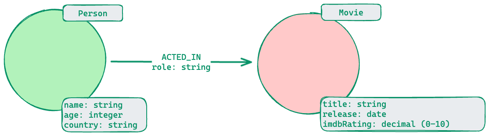

# Data Modeling

When performing the graph data modeling process for an application, you will need at least two types of models:

* Data model
* Instance model

## Data Model

The data model describes the labels, relationships, and properties for the graph. It does not have specific data that will be created in the graph.

Here is an example of a data model:
{data-zoomable}

A Neo4j best practice is to use the following when you name the elements of the graph, but you are free to use any convention for your application.

* A label is a single identifier that begins with a capital letter and can be CamelCase.
  * Examples: Person, Company, GitHubRepo

* A relationship type is a single identifier that is in all capital letters with the underscore character.
  * Examples: FOLLOWS, MARRIED_TO

* A property key for a node or a relationship is a single identifier that begins with a lower-case letter and can be camelCase.
  * Examples: deptId, firstName 

## Instance Model

An important part of the graph data modeling process is to test the model against the use cases. To do this, you need to have a set of sample data that you can use to see if the use cases can be answered with the model.

::: tip
The instance model is just the model data with actual data.
:::

## Best Practices

* Profile (Execution Plan)
 * `PROFILE MATCH (p:Person)-[:ACTED_IN]-() WHERE p.born < '1950' RETURN p.name`
* Limit the number of labels for a node to 4.

