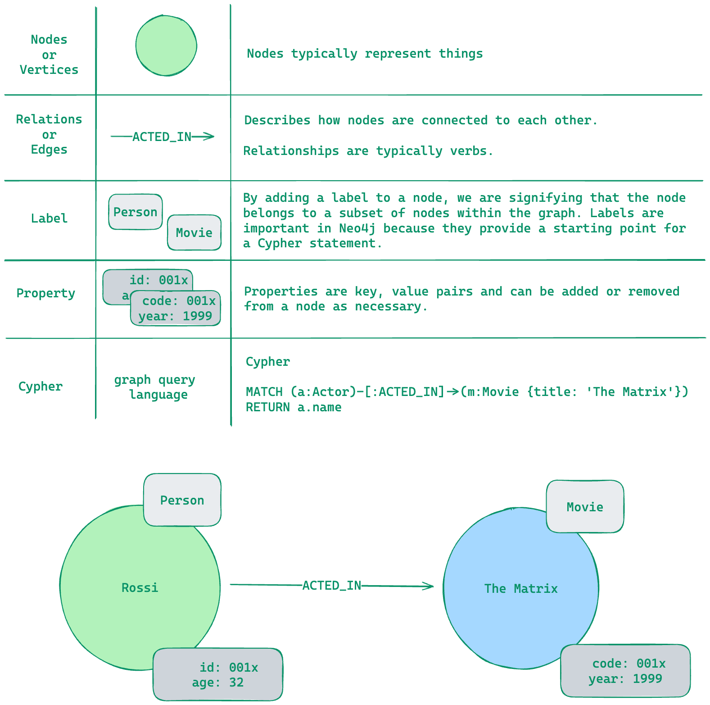

# Neo4j

## Graph Database

Neo4j is a native graph database, which means that it implements a true graph model all the way down to the storage level. The data is stored as you whiteboard it, instead of as a "graph abstraction" on top of another technology. Beyond the core graph, Neo4j also provides: ACID transactions, cluster support, and runtime failover.

## Basic Structure

{data-zoomable}

## Cypher

Cypher is a query language designed for graphs.

### Basics

* Nodes are represented by parentheses ()
* We use a colon to signify the label(s) 
  * `(:Person)`
* Relationships between nodes are written with two dashes
  * `(:Person)--(:Movie)`
* The direction of a relationship is indicated using a greater than or less than symbol < or > 
  * `(:Person)-→(:Movie)`
* The type of the relationship is written using the square brackets between the two dashes: [ and ]
  * `[:ACTED_IN]`
* Properties in Neo4j are key/value pairs,
  * `{name: 'Tom Hanks'}`

### Reading

Return all nodes with Person label
```cypher
 MATCH (p:Person)
RETURN p
```

Return one node
```cypher
 MATCH (p:Person {name: 'Tom Hanks'})
RETURN p
```

In our Cypher statement, we can access properties using a dot notation. For example, to return the name property value using its property key p.name.
```cypher
 MATCH (p:Person {name: 'Tom Hanks'})
RETURN  p.born

// or using where
 MATCH (p:Person)
 WHERE p.name = 'Tom Hanks'
RETURN p.born
```

:::tip
In Cypher, labels, property keys, and variables are case-sensitive. Cypher keywords are not case-sensitive.

Neo4j best practices include:

* Name labels using CamelCase.
* Name property keys and variables using camelCase.
* User UPPERCASE for Cypher keywords.
:::

### Filtering

* Filtering by node labels
```cypher
 MATCH (p:Person)-[:ACTED_IN]->(m:Movie)
 WHERE m.title='The Matrix'
RETURN p.name
```

* Filtering using ranges
```cypher
 MATCH (p:Person)-[:ACTED_IN]->(m:Movie)
 WHERE 2000 <= m.released <= 2003
RETURN p.name, m.title, m.released
```

* Filtering by existence of a property
```cypher
 MATCH (p:Person)-[:ACTED_IN]->(m:Movie)
 WHERE p.name='Jack Nicholson' AND m.tagline IS NOT NULL
RETURN m.title, m.tagline
```

* Filtering by partial strings. You can specify: `STARTS WITH, ENDS WITH, and CONTAINS`
```cypher
 MATCH (p:Person)-[:ACTED_IN]->()
 WHERE toLower(p.name) STARTS WITH 'michael'
RETURN p.name
```

* Filtering by patterns in the graph

Suppose you wanted to find all people who wrote a movie but did not direct that same movie. Here is how you would perform the query:
```cypher
 MATCH (p:Person)-[:WROTE]->(m:Movie)
 WHERE NOT exists( (p)-[:DIRECTED]->(m) )
RETURN p.name, m.title
```

* Filtering using lists
```cypher
 MATCH (p:Person)
 WHERE p.born IN [1965, 1970, 1975]
RETURN p.name, p.born
```

### Creating Nodes

We use the MERGE keyword to create a pattern in the database.

Note that when you use MERGE to create a node, you must specify at least one property that will be the unique primary key for the node.
```cypher
MERGE (p:Person {name: 'Michael Caine'})
```

Executing multiple Cypher clauses
```cypher
 MERGE (p:Person {name: 'Katie Holmes'})
 MERGE (m:Movie {title: 'The Dark Knight'})
RETURN p, m
```

:::tip TIP
Using CREATE instead of MERGE to create nodes
Cypher has a CREATE clause you can use for creating nodes. The benefit of using CREATE is that it does not look up the primary key before adding the node. You can use CREATE if you are sure your data is clean and you want greater speed during import. We use MERGE in this training because it eliminates duplication of nodes.
:::


### Creating Relationship

Just like you can use MERGE to create nodes in the graph, you use MERGE to create relationships between two nodes. First you must have references to the two nodes you will be creating the relationship for. When you create a relationship between two nodes, it must have:

* Type
* Direction

```cypher
MATCH (p:Person {name: 'Michael Caine'})
MATCH (m:Movie {title: 'The Dark Knight'})
MERGE (p)-[:ACTED_IN]->(m)
```

Creating nodes and relationships using multiple clauses
```cypher
MERGE (p:Person {name: 'Chadwick Boseman'})
MERGE (m:Movie {title: 'Black Panther'})
MERGE (p)-[:ACTED_IN]-(m)
```

::: warning
Note that in this MERGE clause where we create the relationships, we did not specify the direction of the relationship. 
By default, if you do not specify the direction when you create the relationship, it will always be assumed left-to-right.
:::

Using MERGE to create nodes and a relationship in single clause
```cypher
 MERGE (p:Person {name: 'Emily Blunt'})-[:ACTED_IN]->(m:Movie {title: 'A Quiet Place'})
RETURN p, m
```

### Updating Properties

Adding properties for a node or relationship

1. Inline as part of the MERGE clause
```cypher
 MERGE (p:Person {name: 'Michael Caine'})
 MERGE (m:Movie {title: 'Batman Begins'})
 MERGE (p)-[:ACTED_IN {roles: ['Alfred Penny']}]->(m)
RETURN p,m
```

2. Using the SET keyword for a reference to a node or relationship
```cypher
 MATCH (p:Person)-[r:ACTED_IN]->(m:Movie)
 WHERE p.name = 'Michael Caine' AND m.title = 'The Dark Knight'
   SET r.roles = ['Alfred Penny'], r.year = 2008
RETURN p, r, m
```

Removing properties
```cypher
 MATCH (p:Person)-[r:ACTED_IN]->(m:Movie)
 WHERE p.name = 'Michael Caine' AND m.title = 'The Dark Knight'
REMOVE r.roles
RETURN p, r, m
```
or
```cypher
 MATCH (p:Person)
 WHERE p.name = 'Gene Hackman'
   SET p.born = null
RETURN p
```

### Merge Tips

Define values during merge
```cypher
 MERGE (p:Person {name: 'McKenna Grace'})
    ON CREATE SET p.createdAt = datetime()
    ON MATCH SET p.updatedAt = datetime()
   SET p.born = 2006
RETURN p
```

You can use MERGE to create nodes or relationships:
```cypher
MERGE (p:Person {name: 'Michael Caine'})
MERGE (m:Movie {title: 'The Cider House Rules'})
MERGE (p)-[:ACTED_IN]->(m)
```

Another way your can create these nodes and relationship is as follows:
```cypher
MERGE (p:Person {name: 'Michael Caine'})-[:ACTED_IN]->(m:Movie {title: 'The Cider House Rules'})
RETURN p, m
```
