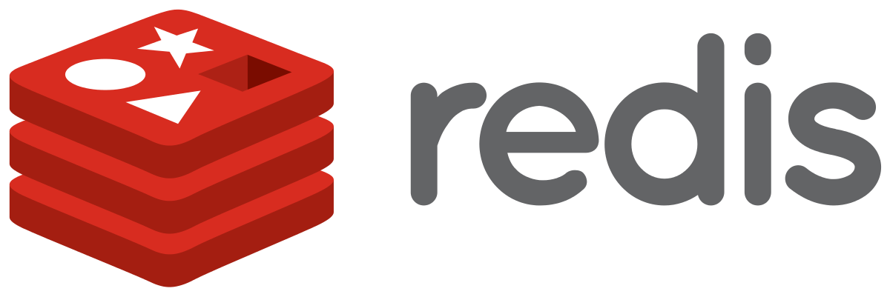

# Redis

Redis is an in-memory data structure store used as a database, cache, and message broker.

Common use cases:

* Cache
  * Build better experiences that grow with you—with accessible, enterprise-grade caching built by the devs who brought you open source Redis.
* Database
  * Use Redis as your NoSQL database to build fast, reliable apps that make five-9s uptime look easy.
* Vector
  * Make your AI app smarter and faster with streamlined document search, recommendation systems, semantic caching, and Retrieval Augmented Generation (RAG).