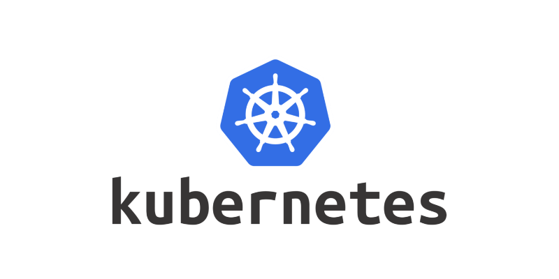
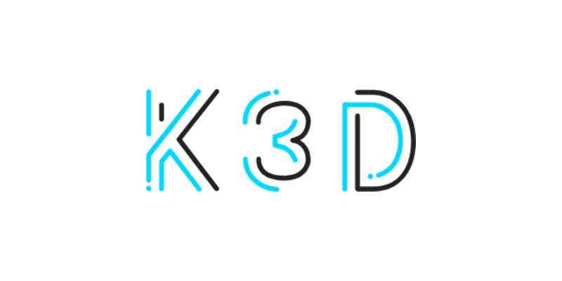
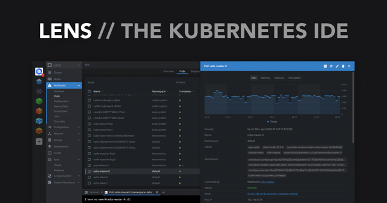
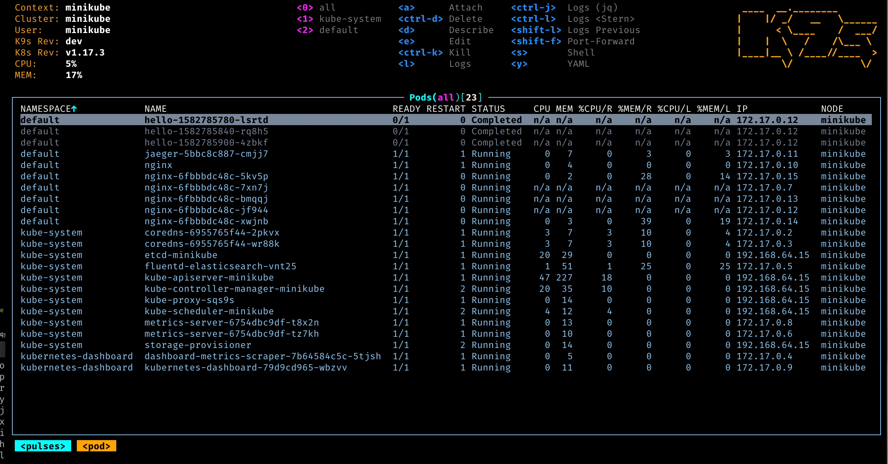
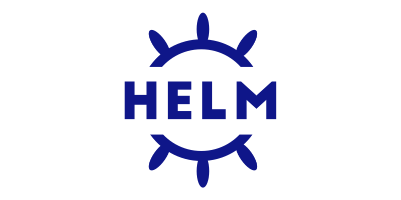

# Kubernetes

## Kubernetes



[K8s - Official Docs](https://kubernetes.io/pt-br/docs/concepts/overview/what-is-kubernetes/)

Kubernetes is a portable, extensible, open source platform for managing containerized workloads and services, 
that facilitates both declarative configuration and automation. 
It has a large, rapidly growing ecosystem. Kubernetes services, support, and tools are widely available.

### Components and Manifests

Components of K8s and examples on how to declare them via manifests in k8s.

[Components - Docs](components/index.md)

### Concepts

Important concepts about kubernetes.

[Concepts - Docs](concepts/index.md)

## K3D



[K3D - Official Docs](https://k3d.io)

k3d is a lightweight wrapper to run k3s (Rancher Lab’s minimal Kubernetes distribution) in docker.

k3d makes it very easy to create single- and multi-node k3s clusters in docker, e.g. for local development on Kubernetes.

### Requirements

* docker to be able to use k3d at all
* kubectl to interact with the Kubernetes cluster

```bash
brew install k3d
```

### Create Cluster

Creating K8s cluster in one line.

::: tip
If you wanna expose your cluster in the local networ, provide your machine IP in --tls-san section.
:::

### Usage
```bash
k3d cluster create <CLUSTER_NAME> --agents 4 --servers 1 --k3s-arg "--tls-san=<YOUR_MACHINE_IP>@server:*"
```

Real Example
```bash
k3d cluster create home --agents 4 --servers 1 --k3s-arg "--tls-san=192.168.0.243@server:*"
```

List Clusters
```bash
k3d cluster list
```

## Lens - GUI for K8s 



[Open Lens Github](https://github.com/MuhammedKalkan/OpenLens)

Lens Desktop is the only application you need to take control of your Kubernetes clusters. It's built on open source and free.

### Install
```bash
brew install --cask openlens
```

::: tip Important Extensions
@alebcay/openlens-node-pod-menu --> Enables pods logs and shell.

:::

Go to extensions (ctrl+shift+e) add this name in the box: @alebcay/openlens-node-pod-menu and hit install

## K9S - TUI for K8s



[K9s Site](https://k9scli.io/)

K9s is a terminal based UI to interact with your Kubernetes clusters. The aim of this project is to make it easier to navigate, observe and manage your deployed applications in the wild.

### Install

```bash
 brew install derailed/k9s/k9s
```

## Helm Charts



The best way to deploy apps on kubernetes.

[Helm - Site](https://helm.sh/)

Helm uses a packaging format called charts. A chart is a collection of files that describe a related set of Kubernetes resources. 
A single chart might be used to deploy something simple, like a memcached pod, or something complex, like a full web app stack with HTTP servers, databases, caches, and so on.

### Artifact Hub

Find, install and publish Kubernetes packages.

[Artifact Hub - Site](https://artifacthub.io/)
