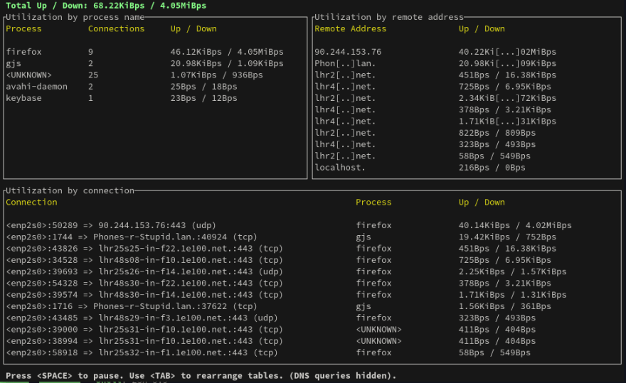

# Linux
::: info
Work in progress
:::

## wget
```bash
wget --quiet  https://sourceforge.net/projects/pentaho/files/Pentaho-9.2/server/pentaho-server-ce-9.2.0.0-290.zip/download -O pentaho.zip
```
## route

Sometimes you need to add a route to a specific network interface. Example:

Your server ip range is 192.168.0.x and your home network is 192.168.0.x

You connect to a vpn, but you change access your server, because it colides with your home network.

```bash
# x -> your server ip
# utun3 -> your vpn interface
sudo route add 192.168.0.x -interface utun3
```
## nohup

Execute process and exit.
    
```bash
nohup ./process.sh &
```

## Useful Tools

### GPING
Ping, but with a graph. 


[Project GitHub](https://github.com/orf/gping)

```bash
brew install gping
```
Usage:

```bash
gping google.com -s --clear --watch-interval 1
```

### Bandwhich
Show bandwidth usage, connection information, outgoing hosts and DNS queries in real-time



```bash
brew install bandwhich
```