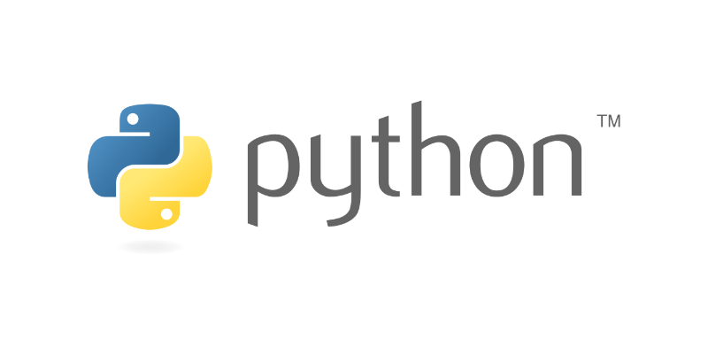
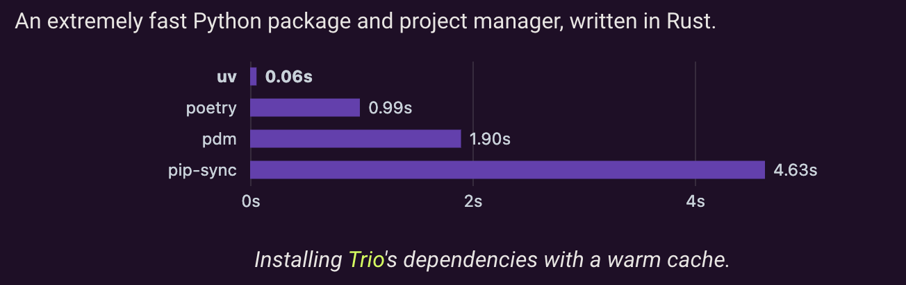
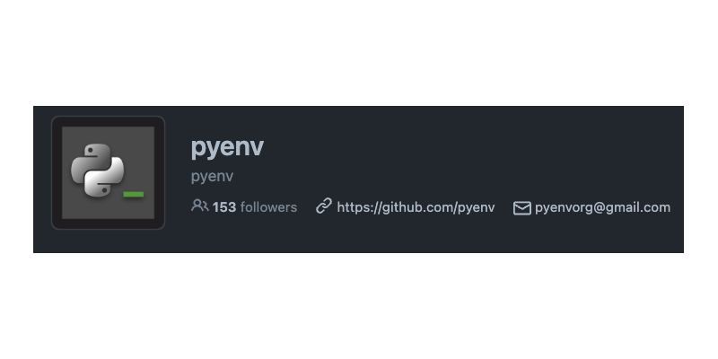
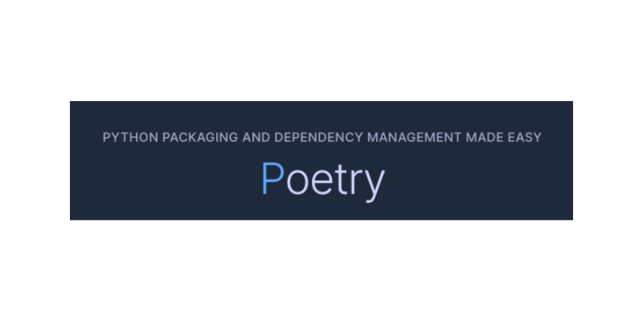

# Python



Python is a programming language that lets you work quickly
and integrate systems more effectively.

Best practices for installing and creating virtual environments to work with Python.

---

## New tools
:::tip TIP
I've been experimenting with UV recently, so this is still a WIP.
:::

### UV

An extremely fast Python package and project manager, written in Rust.



[Github](https://github.com/astral-sh/uv)

#### Install
```sh
curl -LsSf https://astral.sh/uv/install.sh | sh
```

#### Manage Python
```sh
# show installed version
uv python list

# install python version
uv python install 3.11.9
```

#### Manage Project and Env
```sh
# Init project and set  minimum supported Python version
uv init --python 3.9

# Create virtual env with specific python version
uv venv --python 3.9.916

# Activate virtual env
source .venv/bin/activate

# Deactivate virtual env
deactivate

# Add a package to the project
uv add <package_name>

# Remove Packages
uv remove <package_name>

# Sync dependencies with the lock file
uv sync

# Lock the current dependencies to a file
uv lock
```

#### Run Python
```sh
uv run script.py
```


## Consolidated tools
:::tip TIP
How most of my projects used to be structured.
:::

### PyEnv



Pyenv lets you easily switch between multiple versions of Python. 
It's simple, unobtrusive, and follows the UNIX tradition of single-purpose tools that do one thing well.

[PyEnv - Github](https://github.com/pyenv/pyenv)

How to install PyEnv

```bash
# Install PyEnv
brew install pyenv
```

How to use PyEnv

```bash
# Install PyEnv
brew install pyenv

# Install python version
pyenv install 3.9.11

# Set global python version
pyenv global 3.9.11

# Set local python version
pyenv local 3.9.11

```

### Poetry



[Poetry - Github](https://github.com/python-poetry/poetry)

[Poetry - Installations Methods](https://python-poetry.org/docs/)

Install poetry
```bash
curl -sSL https://install.python-poetry.org | python3 -
```

Poetry commands
```shell
# Create new project
poetry new my-folder --name my-package

# Init poetry in existing project
poetry init

# Install package = (pip install)
poetry add django

# Access virtual env
poetry shell

# Update package to specific version
poetry add django@2.2.19

# Set python version
poetry env use python3.7

## If above command fails, try this
poetry env use $(pyenv which python)
```

Generate requirements.txt
```shell
poetry export --without-hashes --format=requirements.txt > requirements.txt
```