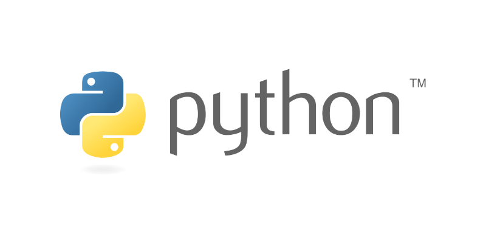
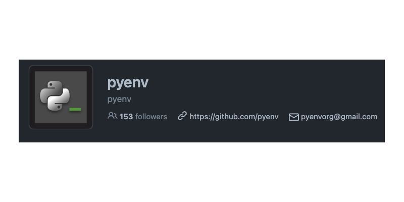
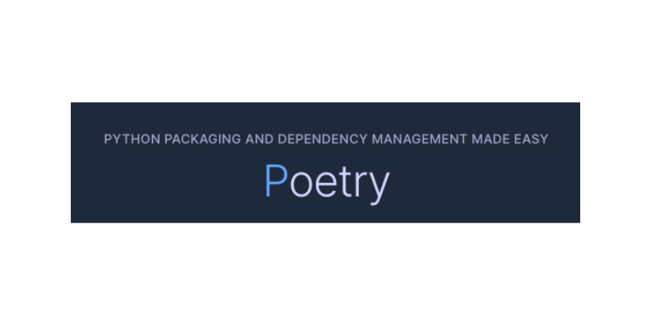

# Python



Python is a programming language that lets you work quickly
and integrate systems more effectively.

Best practices for installing and creating virtual enviroments to work with python.

## Packages


List of uselful packages (focus on data engineering).

[Packages](/development/python/packages/index.md)

## PyEnv



Pyenv lets you easily switch between multiple versions of Python. 
It's simple, unobtrusive, and follows the UNIX tradition of single-purpose tools that do one thing well.

[PyEnv - Github](https://github.com/pyenv/pyenv)

How to install PyEnv

```bash
# Install PyEnv
brew install pyenv
```

How to use PyEnv

```bash
# Install PyEnv
brew install pyenv

# Install python version
pyenv install 3.9.11

# Set global python version
pyenv global 3.9.11

# Set local python version
pyenv local 3.9.11

```

## Poetry



[Poetry - Github](https://github.com/python-poetry/poetry)

[Poetry - Installations Methods](https://python-poetry.org/docs/)

Install poetry
```bash
curl -sSL https://install.python-poetry.org | python3 -
```

Poetry commands
```bash
# Create new project
poetry new my-folder --name my-package

# Init poetry in existing project
poetry init

# Install package = (pip install)
poetry add django

# Access virtual env
poetry shell

# Update package to specific version
poetry add django@2.2.19

# Set python version
poetry env use python3.7

## If above command fails, try this
poetry env use $(pyenv which python)
```