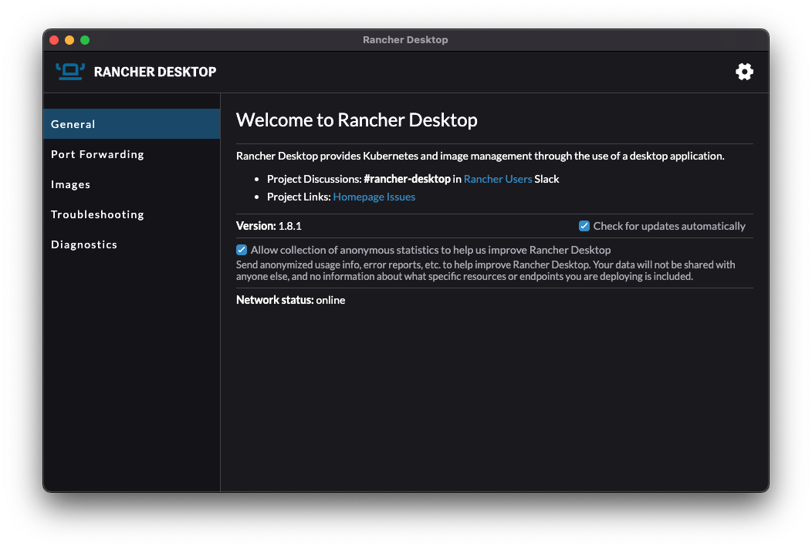
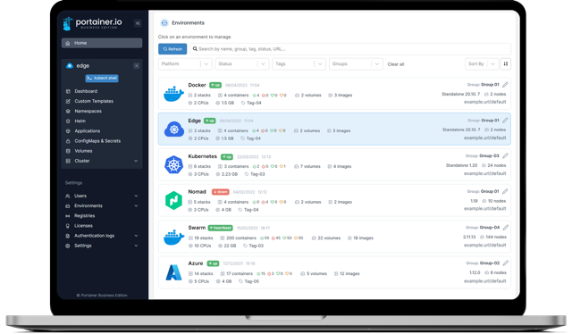
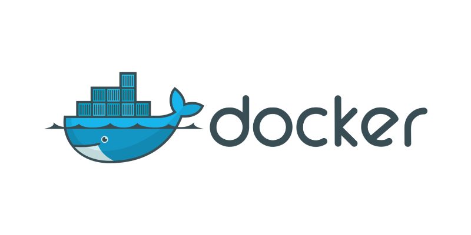

# Containers

## Rancher Desktop

A great alternative to docker desktop.
Rancher Desktop is delivered as a desktop application.
You can download it from the releases page on GitHub.

https://docs.rancherdesktop.io/getting-started/installation/



## Portainer

Portainer Community Edition (CE) is our foundation. With over half a million regular users, CE is a powerful, open source toolset that allows you to easily build and manage containers in Docker, Docker Swarm, Kubernetes and Azure ACI.

https://docs.portainer.io/start/install-ce



::: warning
Attention to install the correct version CE (Community Edition).
:::

Create volume
```bash
docker volume create portainer_data
```

Run portainer
```bash
docker run -d -p 8000:8000 -p 9000:9000 --name=portainer --restart=always -v /var/run/docker.sock:/var/run/docker.sock -v portainer_data:/data portainer/portainer-ce
```

## Container Management

Basic commands to manage containers




```bash
# List all local images
docker images

# Run image
docker run image

# Destroy image
docker rmi image

# Start container
docker start container

# Stop container
docker stop container

# Destroy container
docker rm container

# List running containers
docker ps

# List all containers
docker ps -a
```

## Build Images

```bash
# Login into dockerhub
docker login --username=theuzz1

# If building from arm machimes, remember to use correct platform to build
docker buildx build --platform=linux/amd64 -t kafka-admin:latest  .

# Tag the image
docker image tag kafka-admin theuzz1/kafka-admin:latest

# Push to dockerHub
docker image push theuzz1/kafka-admin:latest
```

## Dockerfile

::: tip
ToDo

Create a streamlit python app example
:::
