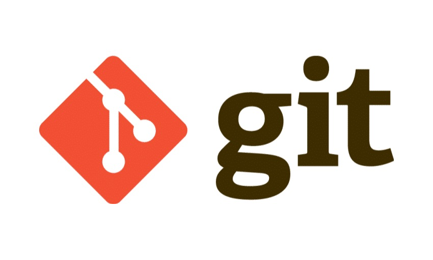

# Programming

## Brew

[Brew - Site](https://brew.sh/)

All steps here documented by default uses brew as a package manager.
Brew is famous in macOS scene, but can also be installed on linux machines.


### Install
```bash
/bin/bash -c "$(curl -fsSL https://raw.githubusercontent.com/Homebrew/install/HEAD/install.sh)"
```

## GIT
[GIT - Docs](git/index.md)

Free and open source distributed version control system.



## Python

[Python - Docs](python/index.md)

Python is a programming language that lets you work quickly
and integrate systems more effectively.


